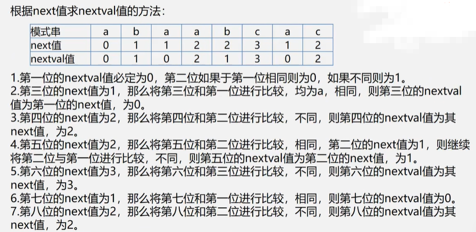
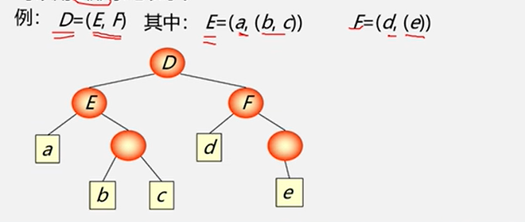

#### 第四章 串

1. ###### 串：

   1. 串类型的最小操作子集：串赋值、串比较、求串长、串联接、求子串

   2. 逻辑结构：线性结构 

   3. 存储结构：顺序存储结构、链式存储结构、块链存储结构

   4. 存储密度：


$$
   串值所占的存储位/
   实际分配的存储位
$$

   

2. ##### KMP算法

   ###### 改进：每当一趟匹配过程中出现字符比较不等时，不需回溯i指针，而是利用已经得到的“部分匹配”的结果将<u>模式串向右“滑动”尽可能远的一段距离</u>(根据“部分匹配”的结果改变j指针的位置)后，继续比较。

   ###### 求next函数值问题：运用KMP算法解决整个模式串既是主串也是模式串的模式匹配问题。

   ###### 最大特点：指示主串的指针不需回溯，整个匹配过程中，对主串仅需从头至尾扫一遍，可以边读边匹配，而无需回头重读。

   时间复杂度O(m+n)

###### 		nextval 修改方法:



```c
int Index_KMP(SString S,SString T,int pos)
{
    i=pos,j=1;
    while(i<S.length&&j<T.length)
    {
        if(j==0||S.ch[i]==T.ch[i])
        {
            i++;j++; 
        }
        else
            j=next[j];/*模式串向右移动*/
    }
    if(j>T.length)
        return i-T.length;/*匹配成功*/
    else
        return 0;/*不匹配*/
}

void get_next(SString T,int &next[])
{
    i=1;next[1]=0;j=0;
    while(i<T.length)
    {
        if(j==0||T.ch[i]==T.ch[j])
        {
            ++i;++j;
            next[i]=j;
        }
        else
            j=next[j];
    }
}
```

#### 第五章 数组和广义表

线性表的扩展（表中的数据元素本身也是以一种数据结构）

1. ###### 数组：按照一定格式排列起来的<u>具有相同类型</u>的数据元素的集合。

   1. 一维数组：数据元素位非结构的简单元素（线性结构）
   2. 二维数组：一维数组中的数据元素又是一维数组结构（非线性结构：每个元素既在一个行表中，又在一个列表中，每个元素有多个前驱和后继 ；线性结构：该线性表的每个数据元素也是一个定长的线性表）
   3. n维数组：n-1维数组中的元素又是一个一维数组（或数据类型为n-1维数组的一维数组）；每个元素受n个关系约束
   4. 数组的特点：结构固定（定义后，维数和维界不再改变）
   5. 数组的基本操作：结构的初始化、销毁、取元素、修改元素值

1. ###### <u>采用顺序存储结构来表示数组</u>（存储单元为一维结构，数组为多维结构，因此存在次序约定问题）

   1. 二维：以行优先存储（底下标优先）；以列优先存储（高下标优先）

   2. 三维：按页/行、列，页优先的顺序存储；页按行（或列）优先存储

   3. 二维数组A[m] [n]以 行序为主序：开始存储位置LOC(0,0)，存储每个元素需要L个存储单元，数组元素a[i] [j]的存储位置是：

   $$
     LOC(i,j)=LOC(0,0)+(n*i+j)*L
   $$

1. ###### 矩阵：m*n个元素排成的m行n列的表

   1. 常规存储：将矩阵描述为一个二维数组（可对元素随机存取、矩阵运算非常简单、存储密度为1）

   2. 压缩存储：多个数据元素的值相同，则只分配一个元素值的存储空间，且零元素不占存储空间（对称阵、对角阵、三角阵、稀疏阵<非零元素个数非常少 小于5%>

   3. 对称阵：将n^2个元压缩存储到n(n+1)/2个元的空间中，以行序为主存储下三角(包括对角线)中的元。sa[k],k=i*(i-1)/2+j-1（或j*(j-1)/2+i-1);

   4. 三角矩阵(对角线以下(或以上)的数据元素(不包括对角线)全为常数c):

      

   5. 对角矩阵(带状矩阵)

        

   6. 稀疏矩阵(三元组法)：(i,j,aij): i-行号，j-列号，aij-值;“总体”信息-总行数+总列数+非零元素个数

     优点：非零元在表中按行序有序存储，便于进行以行顺序处理的矩阵运算。

     缺点：不能随机存取。

   7. 稀疏矩阵(十字链表)：(row，col，value，right，down)，right-用于链接同一行的下一个非零元素，down-用以链接同一列中的下一个非零元素。

     优点：灵活插入因运算而产生的新的非零元，删除因运算而产生的新的零元素。

1. ###### 广义表：LS=(a1,a2,····an),其中LS为表名，n为表的长度，每一个ai为表的元素，表元素可以具有不同结构，大写字母表示广义表，小写字母表示原子

   1. 表头：若LS非空（n>=1),则其第一个元素a1就是表头（可以是原子，也可以是子表）。
   2. 表尾：除表头之外的其他元素组成的<u>“表”</u>(不是最后的元素)。
   3. 数据元素具有相对次序，一个直接前驱和一个直接后继。
   4. 长度：最外层所包含元素的个数。
   5. 深度：该表展开后所包含括号的重数（“原子”的深度为0，“空表”的深度为1）。
   6. 特点：

     ①广义表可以为其他广义表共享;广义表可以是一个递归表(长度为有限值，深度为无穷值)。

     ②广义表是多层次的，其元素可以是单元素，也可以是子表，而子表的元素也可以是子表··· 。

   

     ③任何一个非空列表，其表头可能是原子，也可能是列表，其表尾必定为列表。

     ④广义表：线性表的推广，可以兼容线性表、数组、树和有向图等。当二维数组的每行（或每列）作为子表处理的时候，二维数组即为一个广义表。
   
   7. 基本运算：求表头GetHead(L)，求表尾GetTail(L)。

#### 树结构和线性结构的比较：

​	

|           线性结构           |                 树结构                 |
| :--------------------------: | :------------------------------------: |
|    第一个数据元素：无前驱    |        根节点(只有一个)：无双亲        |
|   最后一个数据元素：无后继   |      叶子结点(可以有多个)：无孩子      |
| 其他元素：一个前驱，一个后继 | 其他结点(中间节点)：一个双亲，多个孩子 |


#### 第六章 树和二叉树

树型结构(非线性结构)：结点之间有分支；具有层次结构

1. ##### 树(Tree 1:n )

   1. ###### 定义：n个结点的<u>有限集</u>（n>=0，递归定义）

      ①n=0：称为空树

      ②n>0：①有且仅有一个特定的称为根(Root)的结点；②其余结点可分为m(m>=0)个互不相交的有限集T1，T2，T3···Tm，其中每个集合本身又是一棵树，并称为根的字树(SubTree)。{嵌套集合、凹入表示、广义表。

   2. ###### 树的基本术语：

      ①结点：数据元素及其指向子树的分支；根节点：非空树无前驱结点的结点。

      ②结点的度(:结点拥有的子树数)；树的度：树内各结点的度的最大值。

      ③叶子结点(终端结点)：度为 0；分支结点(非终端结点)：度不等于 0；内部结点：根结点以外的分支节点。

      ④结点的子树的根称为该结点的‘孩子’，该节点称为‘孩子的双亲’。

      ⑤有共同双亲的结点称为‘兄弟’；双亲在同一层的结点称‘堂兄弟’；从根到该结点所经分支上的所有结点称为该结点的‘祖先’；以某结点为根的子树中的任一结点称为该结点的‘子孙’。

      ⑥树的深度：树中结点的最大层次。

      ⑦有序树：树中结点的各子树从左至右有次序；无序树：树中结点的各子树无序。

      ⑧森林：m(m>=0)棵互不相交的树的集合。):把根节点删除的树就变成了森林，一棵树可以看成是一个特殊的森林；给森林中的各子树加上双亲结点，森林就变成了树。

2. ##### 二叉树(结构简单,规律性最强;所有的树都能转换为唯一对应的二叉树)

   1. ###### 定义：n(n>=0)个结点的有限集，它或者是空集(n=0),或者是由一个根节点及两棵互不相交的树分别称作这个根的左子树和右子树的二叉树组成

   2. ###### 特点：

      ①每个结点最大有俩孩子(二叉树中不存在度大于2的结点)；

      ②子树有左右之分，其次序不能颠倒；

      ③二叉树可以是空集合，根可以有为空的左子树或空的右子树。

   3. ###### <u>注意：二叉树不是树的特殊情况，基本术语使用。区别：二叉树结点的子树要区分左子树和右子树，即使只有一颗子树也要区分；树当结点只有一个孩子时，就无须区分它的左右次序。</u>

   4. ###### 5种基本形态：

      空二叉树、根和空的左右子树、根和左子树、根和右子树、跟和左右子树。

   5. ###### 性质：

      ①在二叉树的第i层上至多有2^(i-1)个结点(i>=1)；

      ②深度为k的二叉树至多有2^k -1个结点(k>=1)；

      ③对任何一颗二叉树T,如果其叶子树为n0,度为2的节点数为n2，则n0=n2+1(从边总边树证明)；

3. ##### 满二叉树和完全二叉树

   1. ###### 定义：

      ①满二叉树：深度为k且有2^k -1个结点的二叉树(每层都满；叶子节点全都在最底层；同样深度的二叉树结点个数最多、叶子节点个数最多)

      ②完全二叉树：深度为k的具有n个结点的二叉树，当且仅当其每一个结点都与深度为k的满二叉树中编号为1~n的结点一一对应

   2. ###### 特点：

      ①在满二叉树中，从最后一个结点开始，连续去掉任意个结点，即得到一个完全二叉树；

      ②完全二叉树的叶子只可能分布在层次最大的两层上；对任一结点，若其右子树的最大层次为i，则其左子树的最大层次必为i或i+1

   3. ###### 性质：

      ①具有n个结点的完全二叉树深度为：
      $$
      ⌊log_2⁡n ⌋+1
      $$
      
      ②对一颗有n个结点的完全二叉树的结点按层序编号，则对任一结点i(1<=i<=n),有:
      
      1. 如果i=1，则结点i是二叉树的根，无双亲；如果i>1，则其双亲结点是⌊i/2 ⌋。
      2. 如果2i>n，则结点i为叶子结点，无左孩子；否则，其左孩子是结点2i。
      3. 如果2i+1>n，则结点i无右孩子；否则其右孩子就是2i+1。

4. ##### 二叉树的顺序存储

   1. ###### 实现：按满二叉树的结点层次编号，易辰存放二叉树中的数据元素

   2. ###### 缺点：深度为k的且只有k个结点的单支树需要长度为2^k-1的一维数组

   3. ###### 特点：结点关系蕴含在其存储位置中；浪费空间，适于存满二叉树和完全二叉树

5. ###### 二叉链表存储结构(递归定义)

   在n个结点的二叉链表中，有n+1个空指针域
